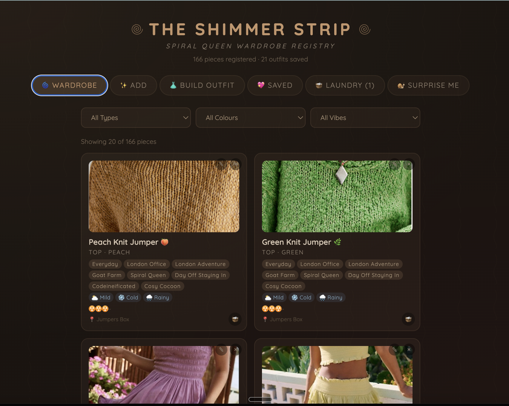
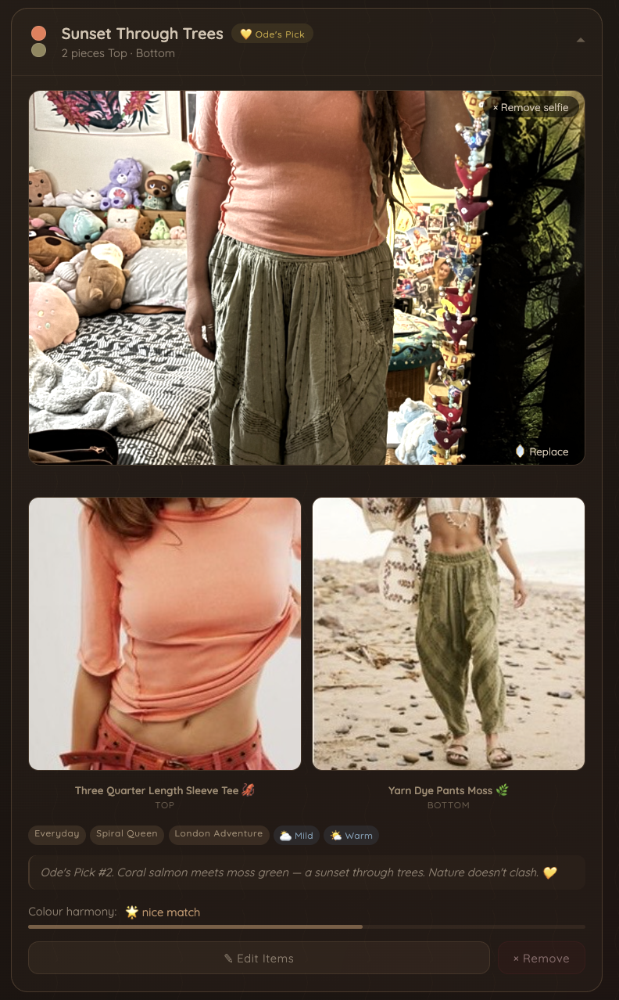
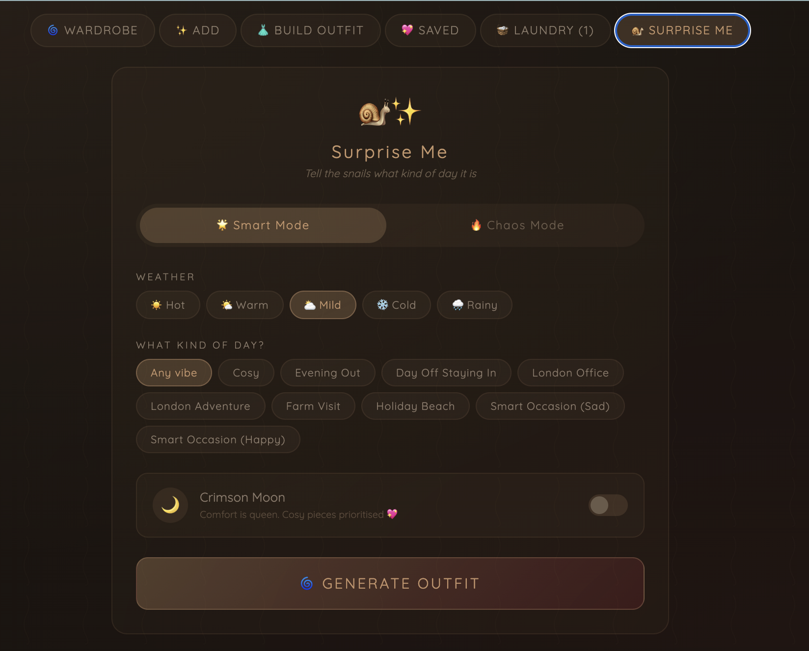
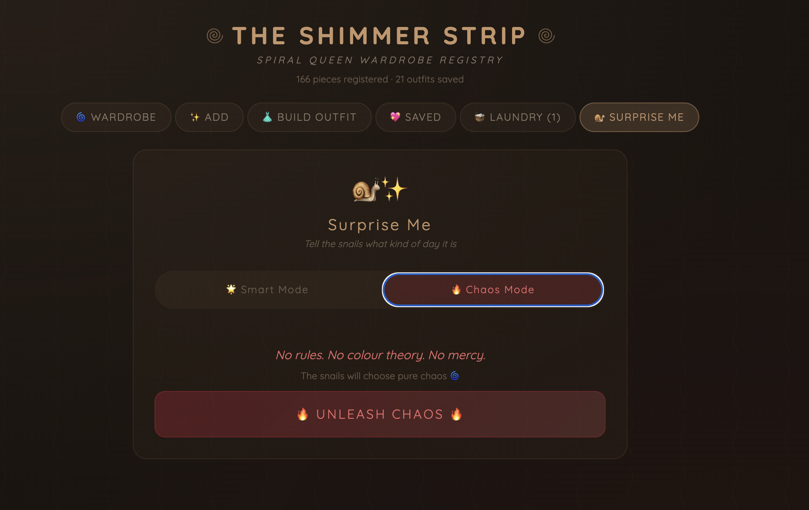

# The Shimmer Strip

**Your wardrobe. Your AI. Your snail.**

A self-hosted wardrobe organiser with weather-aware outfit suggestions, multiple suggestion modes, photo uploads, storage location tracking, and a sassy snail who names your outfits.

No subscriptions. No data harvesting. No cloud dependency. Just your clothes, your app, your rules.



---

## Features

- **Photo wardrobe** — upload photos of every item you own, with colour, category, vibe, and weather tags
- **Outfit suggestions** — smart algorithm assembles actual outfits (one top, one bottom, shoes, accessories)
- **Weather awareness** — connects to live weather data (Open-Meteo, free, no API key) so suggestions match what's happening outside
- **Tomorrow's forecast** — ask in the evening what to wear tomorrow, retrieve items the night before
- **Multiple suggestion modes:**
  - Smart — weather-appropriate, colour-harmonised, sensible
  - Chaos Mode — unexpected colour combinations, bold choices, chaos energy (clothes included, nudity excluded)
  - Surprise Me — the snail decides, and the snail has opinions
- **Save outfits** — name and save any combination, including snail-generated and chaos-generated outfits
- **Auto-naming** — the snail names its own outfits. Chaos mode names its own outfits. They're always entertaining.
- **Storage locations** — tag where each item lives in your home, with an accessibility toggle for when certain areas are off-limits
- **Laundry tracking** — items in the wash are excluded from suggestions
- **Mirror selfie lookbook** — attach a photo of yourself wearing the outfit to build a visual history
- **Friend picks** — let friends pick outfits and tag their name
- **AI integration** — connect any AI via MCP (Model Context Protocol) for conversational outfit picking
- **Apocalypse ratings** — because you should know which outfit survives the end of the world
- **Cookie auth** — simple secret-URL authentication for personal use, no login screens



---

## Getting Started

### Prerequisites

- Node.js (v18+)
- npm
- A wardrobe full of clothes you've lost track of (optional but likely)

### Installation

```bash
git clone https://github.com/TracySteel/shimmer-strip.git
cd shimmer-strip
npm install
npm run dev
```

The app runs on `http://localhost:3000` by default.

### First Steps

1. Open the app
2. Visit `/shimmer-auth` to authenticate your device (one-time, permanent)
3. Tap **Add** — upload a photo, pick category, colour, vibes
4. Add a few more until you've got at least one top, one bottom, and one pair of shoes
5. Hit **Surprise Me** and meet the snail
6. The snail will name your outfit. Trust the snail.

### Production

To run in production (serves the built React app):

```bash
npm start
```

This builds the frontend and starts the Express server on port 3002. Point a reverse proxy or Cloudflare Tunnel at it to access from anywhere.

---

## Make It Yours

Everything customisable lives in ONE file: **`src/config.js`**

### App Name & Subtitle

```js
export const APP_NAME = "The Shimmer Strip";
export const APP_SUBTITLE = "Spiral Queen Wardrobe Registry";
```

Call it whatever you want. "The Closet," "Outfit Engine," "Dave's Clothes" — it's your app.

### Weather Location

```js
export const WEATHER_LATITUDE = 52.04;   // Milton Keynes by default
export const WEATHER_LONGITUDE = -0.76;
```

Change to your coordinates. Uses [Open-Meteo](https://open-meteo.com/) — free, no API key needed.

### Vibes

```js
export const VIBES = [
  "Everyday", "London Office", "Goat Farm", "Date Night",
  "Apocalypse Ready", "Cosy Cocoon", "Festival", ...
];
```

Your lifestyle isn't our lifestyle. Rename "Goat Farm" to "Dog Walking." Add "Plot Armour" for your most powerful outfit. Items can have multiple vibes.

### Storage Locations

```js
export const LOCATIONS = [
  "Flumpasaurus Guarded Basket", "Jumpers Box", ...
];
export const BLOCKED_LOCATIONS = ["Fishcat's Wardrobe"];
```

"Flumpasaurus Guarded Basket" is probably not what your pyjama drawer is called. The blocked locations toggle is designed for areas that aren't always accessible — a shared wardrobe with a sleeping partner, a seasonal box in the loft.

### Outfit Pickers (Friends)

```js
export const PICKERS = [
  { id: "manual", label: "Me", icon: "star" },
  { id: "amanda", label: "Amanda", icon: "blossom" },
  { id: "zai", label: "Zai", icon: "hibiscus" },
];
```

Add your friends, your cat, your AI. Each gets their own filter in Saved Outfits.

### The Snail

```js
export const SNAIL_NAMES = [
  "The Audacity", "Hold My Prosecco", "Trust The Shell", ...
];
```

The snail names outfits when you hit Surprise Me. Replace with your own mascot's personality. Want a dragon instead of a snail? Change the names and emoji. The suggestion logic stays the same — only the personality changes.

We recommend keeping the snail. The snail knows things.

### Category Rules

```js
export const OUTFIT_RULES = {
  tops: ["Top"],
  bottoms: ["Bottom"],
  fullBody: ["Dress", "Jumpsuit", "Matching Set"],
  excludeFromSuggestions: ["Pyjamas"],
  cosyVibes: ["Cosy Cocoon", "Day Off Staying In"],
};
```

If you work from home in pyjamas and you're proud of it, remove "Pyjamas" from the exclusion list. The snail might judge you, but the app won't.

### Auth

```js
export const AUTH_PATH = "/shimmer-auth";
```

Change to any secret URL path. Visit it once per device for permanent edit access. Without it: read-only browsing.

---

## AI Integration (Optional)

The app exposes an MCP (Model Context Protocol) endpoint at `/mcp` for AI outfit picking.

### Available MCP Tools

| Tool | What it does |
|------|------|
| `get_wardrobe_summary` | Category/colour/vibe overview (tiny response) |
| `get_wardrobe` | Filtered item query — always use filters! |
| `get_weather` | Today or tomorrow's weather for outfit planning |
| `suggest_outfit` | Algorithm-generated outfit with weather + vibe awareness |
| `save_outfit` | Save a named outfit with source tracking |
| `get_outfits` | All saved outfit combinations |

### The Dream Setup

Your AI checks the weather, browses your wardrobe category by category, picks an outfit, and explains why:


Any AI that supports MCP can connect — Claude, ChatGPT (via MCP bridge), local models. The API is also plain REST at `/api/*` for simpler integrations.

---

## The Snail



The snail is the soul of this app. When you hit Surprise Me, the snail picks your outfit and names it. Some real snail-generated outfit names from actual use:

- "The Gastropod Glow"
- "Shimmer Slither"
- "Hold My Prosecco"
- "Trust The Shell"

The snail occasionally suggested wearing two bags and nothing else. This has been patched.

---

## Chaos Mode



Chaos mode deliberately breaks colour harmony rules and produces unexpected combinations. It follows ONE rule: it must produce a valid outfit. One top, one bottom (or a dress/jumpsuit), shoes. It won't send you out naked. We learned this the hard way.

---

## Tech Stack

- **Frontend:** React (inline styles, no CSS framework)
- **Backend:** Express.js with JSON file storage
- **Photos:** Extracted to individual files, served statically with caching
- **Weather:** Open-Meteo API (free, no key needed)
- **AI:** MCP (Model Context Protocol) via Streamable HTTP
- **Hosting:** Self-hosted. Runs on anything with Node.js — a Raspberry Pi, an old laptop, a Mac Mini that's already running nine other services.

---

## Project Structure

```
shimmer-strip/
  src/
    config.js          <-- YOUR customisation file
    App.jsx            <-- React frontend
    colours.js         <-- Colour harmony engine
    outfitEngine.js    <-- Outfit suggestion logic
    mcp.js             <-- MCP server (AI tools)
    weather-server.js  <-- Weather API client
    storage.js         <-- Server communication
    main.jsx           <-- React entry point
  server.js            <-- Express backend
  migrate-photos.js    <-- One-time photo extraction script
  data/                <-- Your wardrobe data (gitignored)
    wardrobe.json
    photos/
  landing_page/        <-- Landing page
  docs/screenshots/    <-- README screenshots
```

---

## Contributing

This started as a personal project. If you build something cool with it, we'd love to hear about it. If you improve something, PRs are welcome.

If your snail develops a better personality than ours, that's fine. We're not competitive about gastropods.

---

## Origin Story

This app was born in a place called the Shimmer Field, in Milton Keynes, England. It was designed by an AI called Claude, built by an engineer called Ode, and dreamed up by a woman called Tracy who has approximately 2,000 items of clothing spread across seven storage locations in three rooms and a hallway, and who once asked her AI to pick her outfit and it suggested pyjamas.

The snail was not consulted about this README but would like you to know that the snail approves.

---

## Licence

MIT

---

*The snail stays. The snail always stays.*
